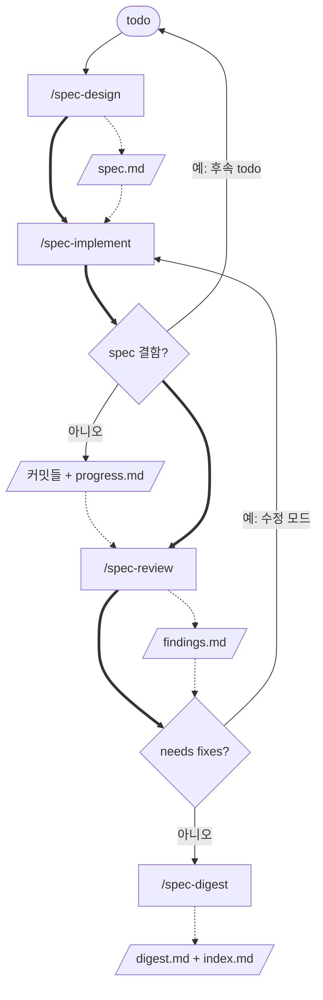

# pyan-minipowers

[English](README.md) | 한국어

**설계도를 먼저 정하고, AI가 짠 코드는 그 설계도를 따르게 한다.**

Claude Code와 Codex에서 쓰는 플러그인 **minipowers**의 마켓플레이스입니다. 설계도는 사람이 승인한 spec 파일입니다.

## 개발 배경

superpowers를 잘 써 왔습니다. 그런데 최근 LLM이 크게 좋아지면서, 이제는 skill이 모델을 돕기보다 제약한다고 판단했습니다. 그래서 절차를 길게 지시하는 대신 방향만 주는 쪽으로 다시 만들었고, 다음을 원칙으로 삼았습니다.

- **best practice를 따른다.** Anthropic의 [Claude prompting best practices](https://platform.claude.com/docs/en/build-with-claude/prompt-engineering/claude-prompting-best-practices)를 참조해 skill을 썼습니다.
- **호출은 명시적으로 한다.** 자동 호출은 같은 상황에서도 skill이 쓰일지 말지가 매번 달라질 수 있어(non-deterministic) 불편했습니다. 그래서 사용자가 `/`로 부를 때만 실행합니다.
- **단계마다 독립된 지능을 쓴다.** 하나의 LLM이 처음부터 끝까지 맡는 대신, 단계마다 새 세션에서 모델을 골라 실행할 수 있습니다. 특히 리뷰는 구현 대화를 모르는 독립 세션에서, 구현과 다른 LLM으로도 돌릴 수 있게 했습니다. 그래서 단계 사이는 대화가 아니라 산출물 파일로 잇습니다.
- **skill을 명확하고 작게 만든다.** 나중에 고치거나 retire하기 쉽도록 skill마다 맡는 일을 좁게 두었습니다.

> skill 지시문(`SKILL.md`)과 공용 규약(`packages/minipowers/skills/_shared/conventions.md`)은 한국어로 쓰여 있습니다.

---

## 핵심

코드 변경 한 건을 **설계 → 구현 → 리뷰 → 기록** 네 단계로 진행합니다. 단계마다 skill 하나가 맡고, 결과를 파일로 남깁니다. MCP 서버 없이 skill만 포함합니다.



실선은 실행 순서이고, 점선은 각 단계가 남기는 산출물과 그것을 읽는 다음 단계입니다.

- **산출물이 쌓인다.** 뒤 단계는 앞 단계들의 산출물을 모두 넘겨받습니다. 예를 들어 리뷰는 `spec.md`, `progress.md`, 구현 커밋의 diff를 함께 읽고, 기록은 여기에 `findings.md`와 소스코드를 더해 읽습니다.
- **분기는 두 곳이다.** 구현 중 spec의 결함으로 더 나아갈 수 없으면 승인된 spec을 고치지 않고 멈춰서 후속 todo(`docs/minipowers/todo/<stem>-followup.md`)를 남깁니다. 그 todo로 `/spec-design`부터 새 사이클을 돕니다. 리뷰가 `needs fixes`이면 구현의 수정 모드로 돌아가 고치고 다시 리뷰합니다. 수정 라운드는 최대 2회이고, 그 뒤에 남은 항목은 사용자가 판정합니다.
- **끝맺음은 사람이 한다.** 병합, push, PR은 어느 단계도 하지 않습니다. `ready to merge` 판정 뒤의 일은 프로젝트의 git 규칙대로 사용자가 합니다.

| 단계 | 호출 | 입력 | 산출물 |
| --- | --- | --- | --- |
| 1. 설계 | `/spec-design <todo 파일 또는 문장>` | todo, 코드베이스, 사용자와의 질의응답 | `spec.md`(사용자와 질의응답으로 정하고 승인받은 설계도), feature 브랜치, `.worktrees/<stem>`, 첫 커밋 |
| 2. 구현 | `/spec-implement <작업 폴더>` | spec, 프로젝트 지시 파일, 소스코드 | 슬라이스별 커밋, `progress.md`. spec 결함으로 멈추면 후속 todo도 |
| 3. 리뷰 | `/spec-review <작업 폴더>` | spec, `기준 커밋..HEAD` diff | `findings.md`(구현 대화를 모르는 새 세션에서 spec 기준으로 diff를 검토한 지적) |
| 4. 기록 | `/spec-digest <작업 폴더>` | spec, progress.md, findings.md, 소스코드 | `digest.md`(소스코드로 확인한 결과 중심 기록), `docs/minipowers/index.md`(작업 목록 색인) |

작업 하나는 `docs/minipowers/<날짜-번호-주제>/` 폴더 하나에 모이고, 인자의 `<작업 폴더>`가 이 경로입니다.

세 가지 원칙이 전부입니다.

- **각 단계는 앞 단계의 산출물만으로 독립해서 진행한다.** 대화 context는 단계 사이로 이어지지 않고, 뒤 단계는 앞 단계들이 남긴 산출물만 받습니다. 그래서 compact나 세션 교체로 대화가 사라져도 결정은 남고, 각 단계를 새 세션·다른 모델에서 이어받을 수 있습니다. 이것이 minipowers의 핵심입니다.
- **명시적 호출로 실행한다.** Claude Code에서는 `/spec-design`, Codex에서는 `$spec-design`처럼 사용자가 직접 부릅니다. frontmatter의 `disable-model-invocation: true` 때문에 Claude Code에서는 "리뷰해줘" 같은 자연어로 시작되지 않습니다. `/spec`까지 입력하면 각 skill의 `argument-hint`가 인자 형식을 보여 줍니다. 두 도구 모두 세션이 시작될 때 skill을 쓰라는 지시를 주입하지 않습니다.
- **결정은 설계 단계에서 끝낸다.** 사용자에게 설계를 묻는 skill은 `spec-design`뿐입니다. 나머지 셋은 설계에 관한 질문을 하지 않고 승인된 spec을 따르며, 멈추는 경우는 [정지 조건 넷](packages/minipowers/skills/_shared/conventions.md#정지-조건)뿐입니다.

`spec-review`는 사용자가 모델과 effort를 선택한 새 독립 세션에서 실행합니다. 구현 때와 다른 LLM을 써도 됩니다. context 0은 이전 대화 이력·요약·메모리를 전달하지 않는다는 뜻이며, 리뷰는 저장된 spec·progress·findings, 프로젝트 지시 파일, 코드베이스와 git diff, 직접 실행한 테스트 결과에 의존합니다. 최초 리뷰와 재리뷰 모두 이 방식으로 진행하며 subagent로 자동 위임하지 않습니다. 추가 리뷰 기준은 승인된 spec에 기록합니다.

이름의 "mini"는 기능이 적다는 뜻이 아니라, 에이전트에게 주는 개입을 최소로 줄였다는 뜻입니다.

---

## 산출물 위치

```
docs/minipowers/
├── index.md
├── todo/<이름>.md                 (spec 결함으로 사이클이 멈추면 `<stem>-followup.md`도 여기 생긴다)
└── <yyyy-mm-dd-##-subject>/
    ├── spec.md
    ├── progress.md
    ├── findings.md
    └── digest.md
```

작업 하나가 폴더 하나입니다. 네 skill의 인자는 이 폴더 경로입니다. 승인된 spec.md는 고치지 않습니다. 일회용 중간물은 `.minipowers/`, 격리 작업 공간은 `.worktrees/`에 두고, 둘 다 `.gitignore`에 들어갑니다. 자세한 규칙은 [conventions.md](packages/minipowers/skills/_shared/conventions.md)에 있습니다.

## 기록되는 것

- **TDD 증거:** progress.md에 슬라이스마다 `RED` 줄(구현 전 실패한 테스트) 또는 `RED 없음` 줄이 남습니다. spec-review는 이 줄이 없는 슬라이스를 지적합니다.
- **기준 테스트:** 첫 슬라이스 전에 전체 테스트를 한 번 돌려 progress.md 머리말에 적습니다. 기준 커밋에서 이미 실패하던 테스트는 spec-review가 이번 변경의 지적으로 올리지 않습니다.
- **반박:** spec-implement는 틀렸다고 판단한 리뷰 지적을 고치지 않고 근거와 함께 반박할 수 있습니다. 재리뷰가 코드로 확인해 WITHDRAWN 또는 NOT ADDRESSED로 판정합니다.
- **슬라이스 모델:** spec의 슬라이스에 `- 모델: <sonnet | opus | fable>`을 적으면 병렬 구현 때 그 모델로 subagent를 띄웁니다.

## 작업 폴더 흐름

메인 체크아웃은 기반 브랜치(예: `dev`)에 그대로 남습니다. 작업은 feature 브랜치를 checkout한 두 번째 작업 폴더 `.worktrees/<stem>`에서 합니다(`git worktree`).

1. `/spec-design`은 승인 뒤 feature 브랜치와 `.worktrees/<stem>`을 만들고, 그 안에서 spec.md를 첫 커밋으로 넣습니다. 메인 체크아웃의 브랜치는 바꾸지 않습니다.
2. `/spec-implement`, `/spec-review`, `/spec-digest`는 메인 체크아웃에서 불러도 `.worktrees/<stem>`을 찾아 그 안에서 읽고 커밋합니다. 구현 결과는 IDE에서 `.worktrees/<stem>` 폴더를 열어 봅니다.
   - `.worktrees/<stem>`이 없으면 `/spec-implement`가 spec.md를 가진 로컬 브랜치를 찾아 worktree를 다시 만듭니다. `/spec-review`와 `/spec-digest`는 worktree를 만들지 않고, 찾은 브랜치 이름과 함께 `/spec-implement`를 먼저 부르라고 안내합니다.
3. 새 worktree에는 gitignore된 파일(의존성, `.env` 같은 로컬 설정)이 없습니다. `/spec-implement`는 구현을 시작하기 전에 worktree를 준비합니다. 프로젝트 지시 파일(CLAUDE.md 등)에 `minipowers worktree 복사: .env, src/appsettings.Development.json`처럼 적은 파일을 메인 체크아웃에서 복사하고, 의존성 설치 명령을 돌립니다. 목록에 없는 파일 때문에 테스트가 실패하면 기존 실패로 넘기지 않고 멈춥니다.
4. 병합은 프로젝트의 git 규칙대로 사용자가 합니다.

병합 뒤에는 메인 체크아웃 루트에서 정리합니다. skill은 안내만 하고 지우지 않습니다.

```bash
git worktree remove .worktrees/<stem>
git branch -d <브랜치>
rm -rf .minipowers/<stem>/
```

---

## 🚀 설치 (최초 1회)

Claude Code 명령은 **대화창**에, Codex 명령은 **터미널**에 입력합니다.

| 하고 싶은 일 | Claude Code | Codex CLI |
| --- | --- | --- |
| 1. 마켓플레이스 등록 | `/plugin marketplace add pyan-labs/pyan-minipowers` | `codex plugin marketplace add pyan-labs/pyan-minipowers` |
| 2. 플러그인 설치 | `/plugin install minipowers` | `codex plugin add minipowers@pyan-minipowers` |
| 3. 설치 확인 | `/plugin` | `codex plugin list` (skill 목록은 세션에서 `/skills`) |
| 업데이트 | `/plugin marketplace update pyan-minipowers` 후 `/plugin update minipowers@pyan-minipowers` | `codex plugin marketplace upgrade pyan-minipowers` 후 `codex plugin add minipowers@pyan-minipowers` |
| 플러그인 제거 | `/plugin uninstall minipowers` | `codex plugin remove minipowers@pyan-minipowers` |
| 마켓플레이스 해제 | `/plugin marketplace remove pyan-minipowers` | `codex plugin marketplace remove pyan-minipowers` |

- Claude Code에서 설치 위치(scope)를 물으면 **user**를 고릅니다. project로 설치하면 그 프로젝트에서만 명령이 보입니다.
- 설치하면 skill이 자동 등록됩니다. 설정 파일을 손으로 만들 필요도, 프로젝트마다 준비할 것도 없습니다.
- minipowers를 쓸 때는 **superpowers를 설치하지 않습니다.** superpowers가 세션마다 자기 skill을 쓰라는 지시를 주입해 minipowers 흐름과 충돌합니다.
- 변경 내역은 [CHANGELOG](CHANGELOG.md)에 있습니다. 업데이트 후에는 새 세션에서 쓰거나, Claude Code에서 `/reload-plugins`로 다시 불러옵니다.

### 요구사항

- spec-implement의 스크립트 세 개(`workspace`, `slice-brief`, `review-package`)는 bash입니다. Windows에서는 Git Bash가 필요합니다.
- 네 skill 모두 로드한 SKILL.md가 있는 폴더를 기준으로 공용 규약(`../_shared/conventions.md`)과 템플릿·스크립트(`./<파일>`)를 찾습니다. 명령의 `<SKILL_DIR>`는 셸에서 접근 가능한 실제 절대경로로 바꾸고 인용합니다. Claude Code와 Codex 모두 호스트의 변수 치환에 의존하지 않습니다.
- spec-implement의 병렬 실행은 subagent를 띄우는 도구(Claude Code의 Agent)가 있을 때만 씁니다. 없으면 에이전트 하나가 순서대로 구현합니다.

---

## superpowers와 무엇이 다른가

[superpowers](https://github.com/obra/superpowers)는 AI 코딩 에이전트에게 brainstorming, TDD, 계획, 리뷰 같은 개발 습관을 skill로 가르치는 훌륭한 플러그인입니다. minipowers는 그 아이디어에서 출발했고, 써 보며 부딪힌 두 가지를 다르게 풀었습니다.

| | superpowers | minipowers |
| --- | --- | --- |
| skill을 실행하는 때 | 세션 시작·clear·compact마다 "skill을 써라"는 지시를 주입해, 원하지 않는 순간에도 끼어든다 | 사용자가 `/`로 부를 때만 |
| 단계를 잇는 것 | 대화 컨텍스트 | 각 단계가 남기는 산출물 (`spec.md`, `progress.md`, `findings.md`) |

## 출처

`packages/minipowers/skills/spec-implement/scripts/`의 세 스크립트는 superpowers(MIT, Jesse Vincent)의 스크립트를 경로와 제목 패턴만 바꿔 가져왔습니다. 각 파일 머리에 출처를 적었고, 원본 라이선스 전문은 [LICENSE-superpowers](packages/minipowers/skills/spec-implement/scripts/LICENSE-superpowers)에 있습니다.

> minipowers는 superpowers에서 영감을 받은 독립 프로젝트입니다. superpowers 프로젝트나 원작자 Jesse Vincent와 관계가 없습니다.
