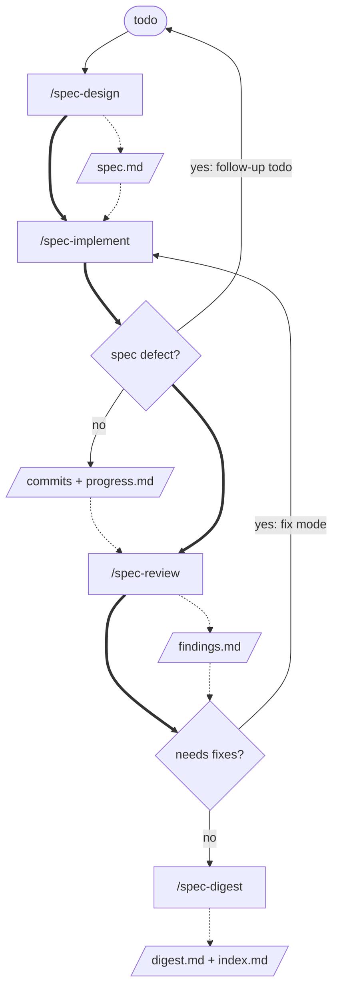

# pyan-minipowers

English | [한국어](README-ko.md)

**Settle the blueprint first, then make the AI-written code follow it.**

A marketplace for **minipowers**, a plugin for Claude Code and Codex. The blueprint is a spec file that a human has approved.

## Background

superpowers served well. But as LLMs have improved a great deal recently, I came to judge that its skills now constrain the model more than they help it. So I rebuilt the workflow to give direction rather than long step-by-step instructions, on these principles.

- **Follow the best practices.** The skills were written with reference to Anthropic's [Claude prompting best practices](https://platform.claude.com/docs/en/build-with-claude/prompt-engineering/claude-prompting-best-practices).
- **Invoke explicitly.** Automatic invocation is non-deterministic: in the same situation, whether a skill gets used can vary from run to run, which I found inconvenient. So a skill runs only when the user calls it with `/`.
- **Use an independent intelligence at each stage.** Instead of one LLM doing everything from start to finish, each stage can run in a fresh session with a model you choose. The review in particular can run in an independent session that knows nothing of the implementation conversation, and with a different LLM than the implementation used. That is why the stages are linked by artifact files, not by conversation.
- **Keep each skill clear and small.** Each skill has a narrow job so that it is easy to fix later, or to retire.

> The skill instructions (`SKILL.md`) and the shared conventions (`packages/minipowers/skills/_shared/conventions.md`) are written in Korean.

---

## The core

A single code change moves through four stages: **design → implement → review → record**. One skill owns each stage and leaves its result in a file. It ships skills only, with no MCP server.



Solid arrows are the execution order; dashed arrows are the artifact each stage leaves and the stage that reads it.

- **Artifacts accumulate.** Each later stage receives all the earlier artifacts. For example, the review reads `spec.md`, `progress.md`, and the diff of the implementation commits together, and the record adds `findings.md` and the source code to those.
- **There are two branch points.** If a spec defect stops the implementation, it does not edit the approved spec; it stops and leaves a follow-up todo (`docs/minipowers/todo/<stem>-followup.md`), and a new cycle runs from `/spec-design` with that todo. If the review says `needs fixes`, work returns to the implementation's fix mode and is reviewed again. There are at most two fix rounds, after which the user decides on what remains.
- **A human closes it out.** No stage merges, pushes, or opens a PR. What comes after a `ready to merge` verdict is up to the user, following the project's git rules.

| Stage | Invocation | Input | Output |
| --- | --- | --- | --- |
| 1. Design | `/spec-design <todo file or sentence>` | the todo, the codebase, Q&A with the user | `spec.md` (the blueprint, settled through Q&A with the user and approved), a feature branch, `.worktrees/<stem>`, the first commit |
| 2. Implement | `/spec-implement <work folder>` | the spec, project instruction files, source code | one commit per slice, `progress.md`; when a spec defect stops it, also a follow-up todo |
| 3. Review | `/spec-review <work folder>` | the spec, the `base-commit..HEAD` diff | `findings.md` (findings from checking the diff against the spec, in a fresh session that knows nothing of the implementation conversation) |
| 4. Record | `/spec-digest <work folder>` | the spec, progress.md, findings.md, source code | `digest.md` (a results-focused record verified against the source code), `docs/minipowers/index.md` (an index of the work) |

One change lives in one folder, `docs/minipowers/<yyyy-mm-dd-##-subject>/`. The `<work folder>` argument is that path.

Three principles are all there is.

- **Each stage runs independently, from the earlier stages' artifacts alone.** No conversation context is carried between stages; each later stage receives only the artifacts the earlier stages left. So if compact or a session swap wipes the conversation, the decisions survive, and each stage can be picked up in a new session or with a different model. This is the core of minipowers.
- **Skills run on explicit invocation.** In Claude Code you call `/spec-design`; in Codex you call `$spec-design`. Because of `disable-model-invocation: true` in the frontmatter, natural language such as "review this" never starts a skill in Claude Code. Type `/spec` and each skill's `argument-hint` shows the argument format. In neither tool does minipowers inject an instruction at session start telling the agent to use skills.
- **Decisions end at the design stage.** `spec-design` is the only skill that asks the user about the design. The other three ask nothing about the design and follow the approved spec; they stop only on the [four stop conditions](packages/minipowers/skills/_shared/conventions.md#정지-조건).

spec-review runs in a fresh, independent session where the user chooses the model and effort. It may use a different LLM than the implementation did. Context 0 means no earlier conversation history, summary, or memory is passed on; the review relies on the saved spec, progress, and findings, the project instruction files, the codebase and git diff, and test results it runs itself. Both the first review and re-reviews work this way, and the review is never delegated automatically to a subagent. Extra review criteria go in the approved spec.

The "mini" in the name does not mean few features; it means the agent is interfered with as little as possible.

---

## Where outputs go

```
docs/minipowers/
├── index.md
├── todo/<name>.md                 (also `<stem>-followup.md`, written when a spec defect stops a cycle)
└── <yyyy-mm-dd-##-subject>/
    ├── spec.md
    ├── progress.md
    ├── findings.md
    └── digest.md
```

One piece of work is one folder. The argument to all four skills is this folder path. An approved spec.md is never edited. Throwaway intermediates go in `.minipowers/` and the isolated workspace goes in `.worktrees/`; both are added to `.gitignore`. Details are in [conventions.md](packages/minipowers/skills/_shared/conventions.md).

## What gets recorded

- **TDD evidence:** for every slice, progress.md gets either a `RED` line (the test that failed before implementation) or a `RED 없음` line ("no RED"). spec-review flags any slice that has neither.
- **Baseline tests:** before the first slice, the whole test suite runs once and the result goes in the progress.md header. A test that already failed at the base commit is not raised by spec-review as a finding against this change.
- **Rebuttal:** spec-implement may rebut a review finding it judges wrong, with reasons, instead of fixing it. The re-review checks the code and rules WITHDRAWN or NOT ADDRESSED.
- **Slice model:** if a slice in the spec carries `- 모델: <sonnet | opus | fable>` (모델 = "model"), parallel implementation launches that slice's subagent with that model.

## Working folder flow

The main checkout stays on the base branch (for example `dev`). Work happens in a second working folder, `.worktrees/<stem>`, which has the feature branch checked out (`git worktree`).

1. After approval, `/spec-design` creates the feature branch and `.worktrees/<stem>`, and commits spec.md there as the first commit. It does not change the main checkout's branch.
2. `/spec-implement`, `/spec-review`, and `/spec-digest` find `.worktrees/<stem>` even when called from the main checkout, and read and commit inside it. To look at the implementation in an IDE, open the `.worktrees/<stem>` folder.
   - If `.worktrees/<stem>` is missing, `/spec-implement` finds the local branch that holds spec.md and recreates the worktree. `/spec-review` and `/spec-digest` do not create a worktree; they tell you the branch name they found and ask you to call `/spec-implement` first.
3. A new worktree has none of the gitignored files (dependencies, local settings such as `.env`). Before implementation starts, `/spec-implement` prepares the worktree: it copies from the main checkout the files listed in a line of the project instruction file (CLAUDE.md and the like) such as `minipowers worktree 복사: .env, src/appsettings.Development.json` (복사 = "copy"), and runs the dependency install command. If a test fails because of a file that is not on the list, it stops instead of writing the failure off as pre-existing.
4. Merging is done by the user, following the project's git rules.

After merging, clean up from the root of the main checkout. The skills only tell you what to do; they delete nothing.

```bash
git worktree remove .worktrees/<stem>
git branch -d <branch>
rm -rf .minipowers/<stem>/
```

---

## 🚀 Install (once)

Type Claude Code commands in the **chat**, and Codex commands in the **terminal**.

| What you want to do | Claude Code | Codex CLI |
| --- | --- | --- |
| 1. Register the marketplace | `/plugin marketplace add pyan-labs/pyan-minipowers` | `codex plugin marketplace add pyan-labs/pyan-minipowers` |
| 2. Install the plugin | `/plugin install minipowers` | `codex plugin add minipowers@pyan-minipowers` |
| 3. Verify the install | `/plugin` | `codex plugin list` (list skills in a session with `/skills`) |
| Update | `/plugin marketplace update pyan-minipowers`, then `/plugin update minipowers@pyan-minipowers` | `codex plugin marketplace upgrade pyan-minipowers`, then `codex plugin add minipowers@pyan-minipowers` |
| Uninstall the plugin | `/plugin uninstall minipowers` | `codex plugin remove minipowers@pyan-minipowers` |
| Remove the marketplace | `/plugin marketplace remove pyan-minipowers` | `codex plugin marketplace remove pyan-minipowers` |

- When Claude Code asks for the install location (scope), choose **user**. If you install at project scope, the commands are visible only in that project.
- Installing registers the skills automatically. You don't need to write config files by hand or prepare anything per project.
- **Do not install superpowers alongside minipowers.** superpowers injects an instruction to use its own skills at every session, which conflicts with the minipowers flow.
- Changes are listed in the [CHANGELOG](CHANGELOG.md). After updating, use a new session, or reload the plugins in Claude Code with `/reload-plugins`.

### Requirements

- The three scripts of spec-implement (`workspace`, `slice-brief`, `review-package`) are bash. On Windows, Git Bash is required.
- spec-review resolves relative paths to the shared conventions and templates from the directory of the SKILL.md it loaded. The other skills point to the shared conventions as `${CLAUDE_PLUGIN_ROOT}/skills/_shared/conventions.md` and to their own folder's templates and scripts as `${CLAUDE_SKILL_DIR}/<file>`. Claude Code substitutes these two variables in the skill body.
- spec-implement's parallel execution is used only when a tool that launches subagents (Claude Code's Agent) is available. Otherwise a single agent implements in order.

---

## How is it different from superpowers?

[superpowers](https://github.com/obra/superpowers) is a fine plugin that teaches AI coding agents development habits such as brainstorming, TDD, planning, and review as skills. minipowers started from that idea and solves two problems we ran into differently.

| | superpowers | minipowers |
| --- | --- | --- |
| When a skill runs | Injects a "use skills" instruction at every session start, clear, and compact, so skills cut in even when you don't want them | Only when the user calls it with `/` |
| What links the stages | The conversation context | The artifacts each stage leaves (`spec.md`, `progress.md`, `findings.md`) |

## Sources

The three scripts in `packages/minipowers/skills/spec-implement/scripts/` were taken from the scripts of the superpowers plugin (MIT, Jesse Vincent), with only the paths and title patterns changed. Each file's header states the origin, and the full original license is in [LICENSE-superpowers](packages/minipowers/skills/spec-implement/scripts/LICENSE-superpowers).

> minipowers is an independent project inspired by superpowers. It is not affiliated with the superpowers project or its author, Jesse Vincent.
